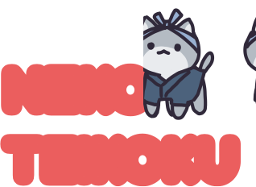
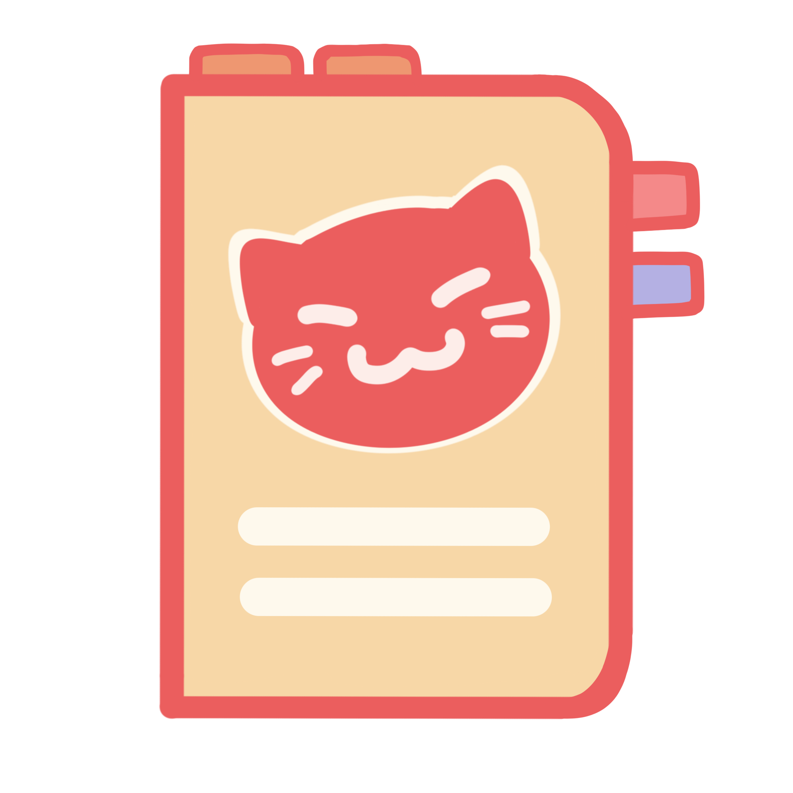
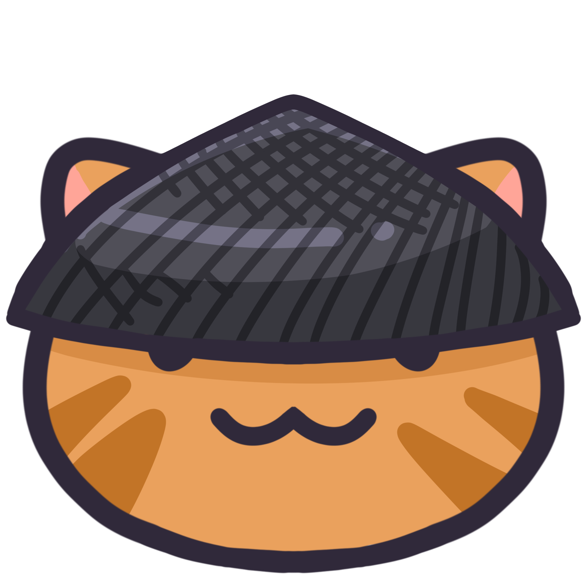
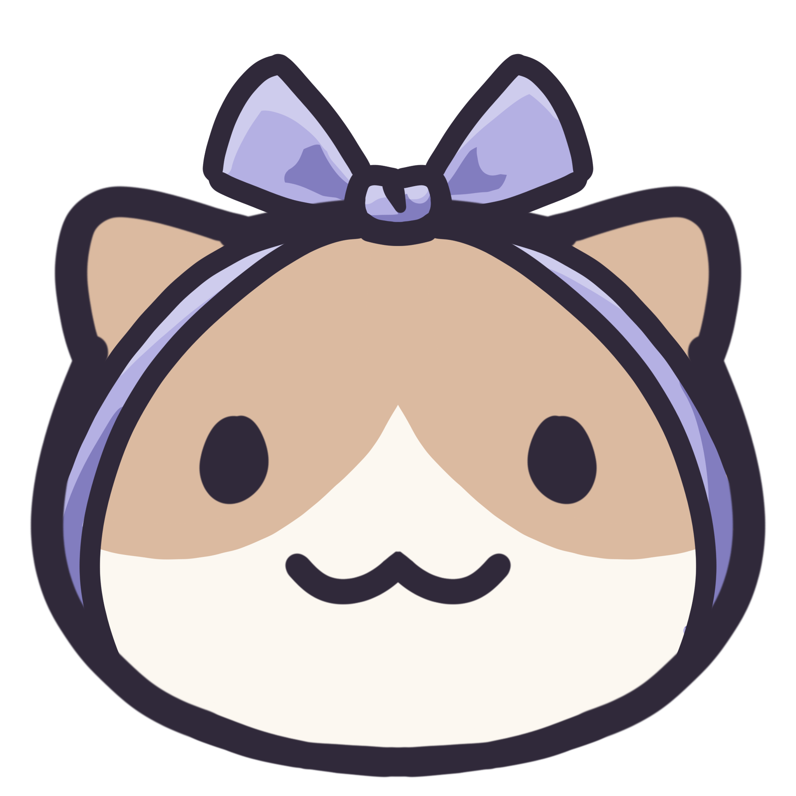
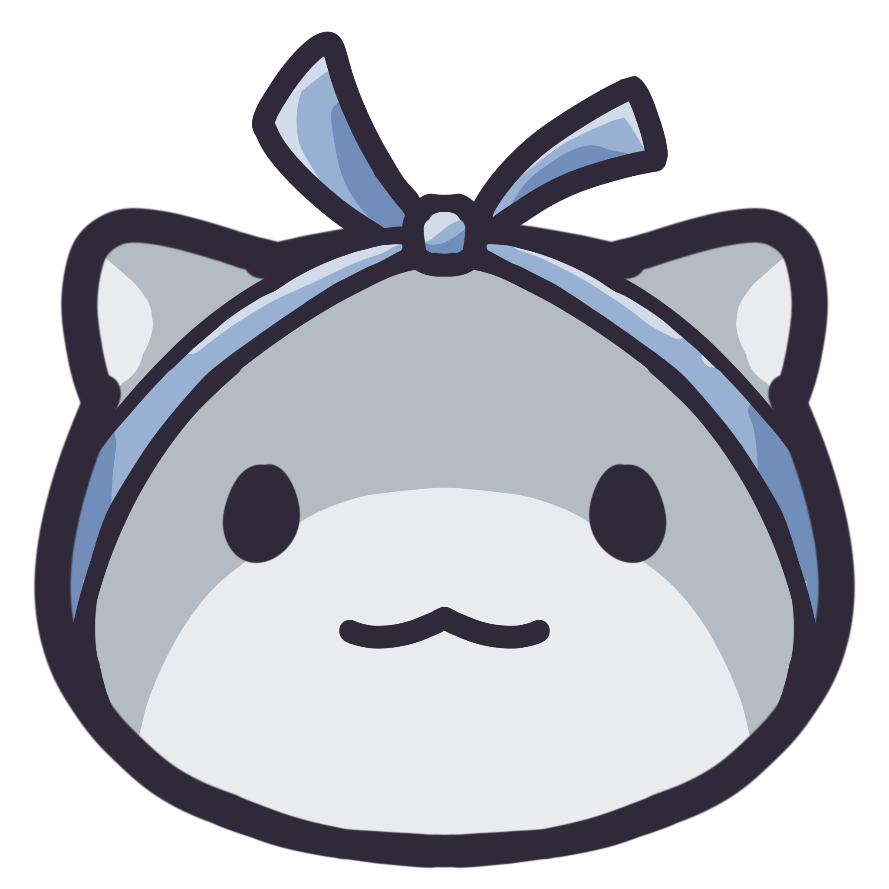
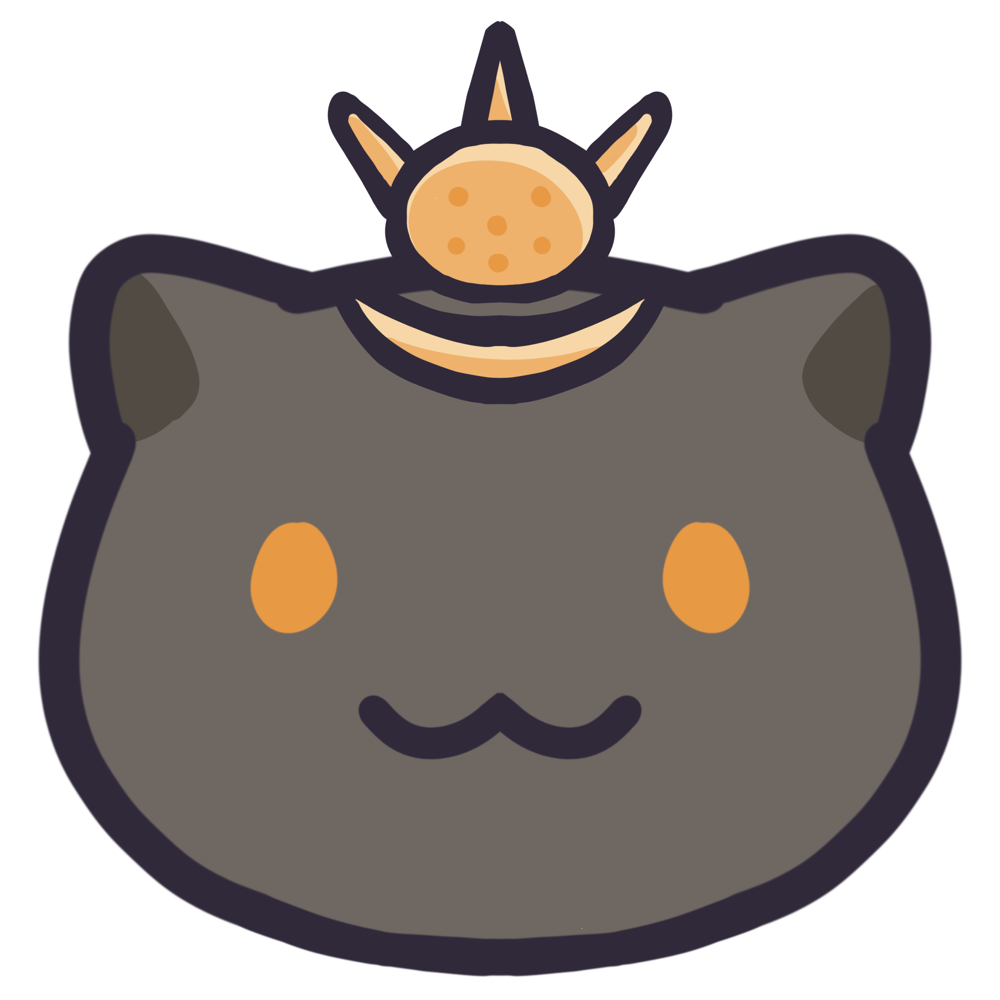
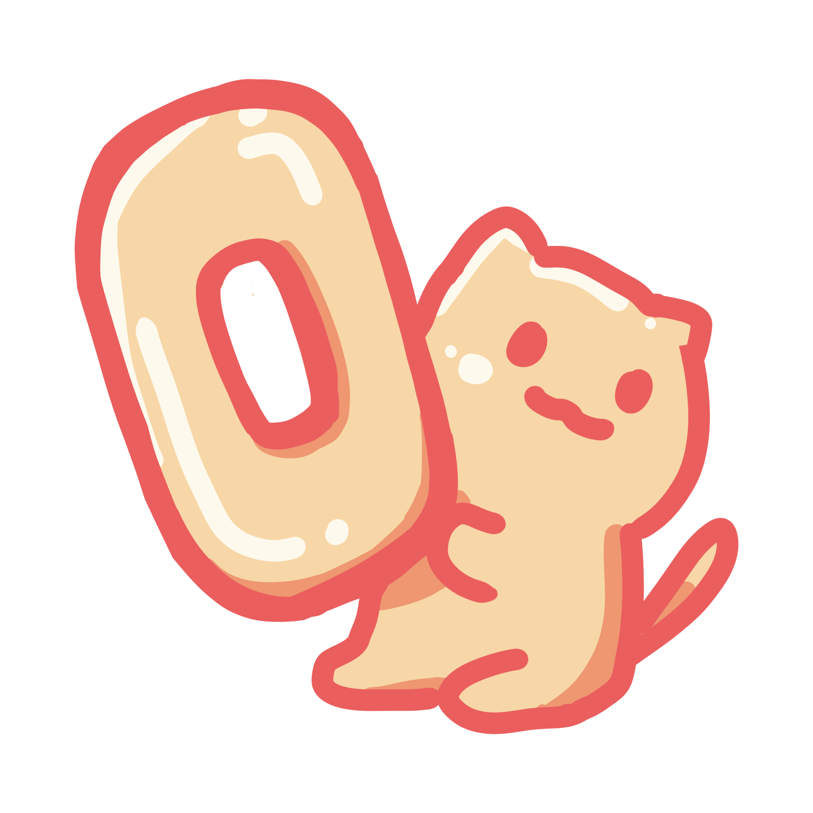

  

## About Neko Teikoku 
Neko Teikoku is a cozy cat web application meant to make you feel cozy. Meow. Grow your empire by attracting other cats and feeding them food!

Apis we are using are: 
 
 [CatBreedDB](https://rapidapi.com/encurate/api/catbreeddb/)  
 [OpenWeatherMapApi](https://openweathermap.org/api)

## Technology used in the web application 
 Next JS,  
 React,  
 Axios,  
 Styled-components,  
 Framer Motion,  
 Use-sound,  
 Lottie React,  
 Firebase  

## Getting Started 
1. Run the cmd in terminal `git clone https://github.com/Pho86/neko_teikoku.git`.

2. Cd into the directory with `cd ./neko_teikoku`.

3. Install the required packages via `npm install` or `yarn dev` or any other package manager.

4. Get api keys from apis provided above and place them in `.env.local` or `.env` by following the `.env.example` file. 

5. Run the development server with `npm run dev` or `yarn dev` or `pnpm dev`.

6. Open [http://localhost:3000](http://localhost:3000) with your browser to see the result. (May be opened in another url depending on whether you have a server running)
